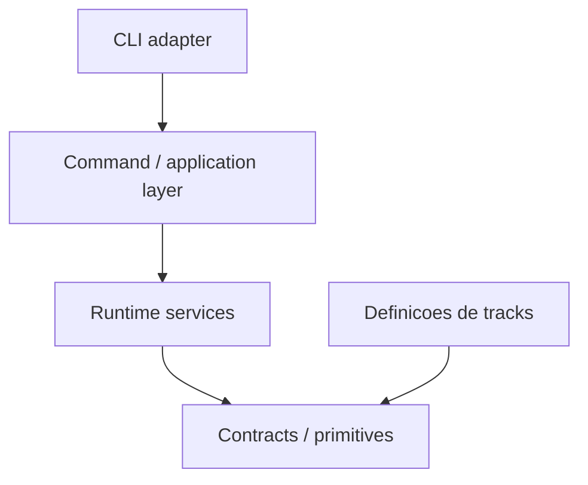

# EAW - Target Architecture

Versao documental: 1. Escopo: EAW 1.0.

## Proposito e autoridade

Este documento estabelece a arquitetura-alvo do Enterprise Agent Workflow:
**Contract-Driven Workflow Runtime**. O runtime DEVE fornecer
mecanismos genericos de workflow; tracks DEVEM fornecer contratos e conteudo.
O runtime opera sobre contratos genericos de track e NAO DEVE depender semanticamente de
tracks concretas como `bug`, `feature`, `spike` ou `ARCH_REFACTOR`.

Esta e uma norma de evolucao, nao uma declaracao de conformidade do codigo atual.
DEVE e NAO DEVE expressam obrigacoes; DEVERIA expressa preferencia cuja excecao
exige justificativa registrada. Os dez principios do mantenedor sao preservados
em [ARCHITECTURE_PRINCIPLES.md](ARCHITECTURE_PRINCIPLES.md), com IDs estaveis.

As fontes possuem papeis distintos:

| Fonte | Papel nesta arquitetura |
|---|---|
| Orientacao oficial e Skills | Como o agente trabalha no EAW; nao definem automaticamente o desenho futuro. |
| Onboarding | Contexto factual do sistema existente, sujeito a validacao no fonte. |
| Auditoria / investigacao | Evidencia datada de divergencias e divida; material de trabalho mantido fora da arquitetura normativa versionada. |
| Principios do mantenedor | Intencao arquitetural que fundamenta o TO-BE. |
| Este documento e os principios associados | Como o EAW deve evoluir; decisoes posteriores usam o [processo de ADR](adr/README.md). |

Os contratos vigentes continuam regendo consumidores e dados existentes. Uma
divergencia entre esta arquitetura e esses contratos NAO autoriza modifica-los
implicitamente. Deve ser registrada e tratada por mudanca explicita, com analise
de compatibilidade.

A arquitetura normativa responde como o EAW DEVE ser estruturado e quais regras
mudancas futuras DEVEM respeitar. Onboarding responde como esta implementado e
pode ser regenerado e validado contra o fonte. Auditorias respondem onde havia
divergencias em determinada data; seus findings NAO DEVEM ser incorporados como
conteudo permanente desta norma.

## Escopo e nao objetivos

O escopo compreende limites logicos, responsabilidades, dependencias, contratos,
compatibilidade e criterios para o saneamento interno do EAW 1.0 por agentes e
mantenedores, preservando conceitos, contratos e comportamento existentes.
Este documento nao autoriza por si so refatoracoes ou mudancas funcionais.
A separacao fisica entre runtime e tracks e os modelos de distribuicao,
repositorios e versionamento independente pertencem a arquitetura 2.0 e estao
fora do escopo desta norma. Nenhum mecanismo para essa separacao e definido aqui.
Nao define um scheduler distribuido, runtime cognitivo multiagente ou plataforma
de execucao da logica de negocio dos repositorios alvo.

## Arquitetura conceitual e dependencias



As setas representam dependencia de definicao ou uso, nao transferencia de
arquivos. Tracks conformam-se aos contratos; os servicos carregam suas instancias
como dados. Ler uma definicao de track identificada por `track_id` nao e depender da sua
semantica. Um ramo que escolhe regras porque `track_id == bug` e essa dependencia.
Conteudos podem compartilhar contratos sem importar implementacoes entre tracks.

Os servicos genericos do runtime usam contratos e primitivas. CLI e application
layer oferecem acesso a esses servicos. As caixas sao owners logicos, nao novos
processos, classes ou diretorios obrigatorios.

Dependencias DEVEM seguir o sentido do diagrama. A camada de aplicacao pode usar
tipos contratuais para coordenar servicos; isso nao permite mover regras para o
adapter. Servicos podem compor responsabilidades inferiores por interfaces
explicitas e sem ciclos. Contracts/primitives NAO DEVEM conhecer handlers, CLI,
templates de tracks concretas ou apresentacao. Core NAO DEVE chamar CLI para
obter regras de workflow. Utilitarios NAO DEVEM servir como deposito de regras
sem owner.

## Boundaries e ownership

Cada responsabilidade DEVE possuir um owner logico unico. Multiplos consumidores
podem chama-lo; multiplas implementacoes concorrentes da mesma regra exigem
justificativa e convergencia explicita. Esta matriz define destinos conceituais,
nao afirma que os arquivos atuais ja respeitam a distribuicao.

| Responsabilidade | Owner alvo | Limite |
|---|---|---|
| Parsing de argumentos, dispatch, help, stdout/stderr e exit codes publicos | CLI adapter | Traduz entrada e resultado; nao decide completion ou transicoes. |
| Casos de uso de criar, avancar, concluir, consultar e validar | Command/application layer | Coordena servicos e ordem do caso de uso; nao reimplementa suas regras. |
| Resolucao de track e phase | Servico de resolucao de contratos | Resolve identificadores e bindings, valida disponibilidade e entrega contratos; nao possui catalogo semantico de tracks. |
| Lifecycle de phase e state machine | Servico de lifecycle | Decide elegibilidade, completion, espera, skip e transicao conforme contrato; unico owner dessas decisoes. |
| Leitura e persistencia de estado | Servico de estado | Valida e serializa o state contract; persiste decisoes do lifecycle, sem escolher a proxima fase. |
| Requisitos e validacao de artifacts | Servico de artifacts | Aplica validadores genericos suportados; conteudo e requisitos especificos pertencem a definicao da track. |
| Resolucao, renderizacao e provenance de prompts | Servico de prompts | Aplica bindings e composicao contratual; nao inventa conteudo especifico de track. |
| Selecao e delimitacao de evidencias | Servico de context | Distingue onboarding estavel de contexto dinamico; nao produz conclusoes analiticas como coleta. |
| Resolucao de Skills e instrucoes operacionais | Servico de contexto operacional | Resolve declaracoes e entrega instrucoes; nao confunde orientacao com evidencia nem redefine lifecycle. |
| Workspace, repositorios e escopos de leitura/escrita | Servico de escopo e ambiente | Resolve configuracao e aplica limites contratados, sem inferir papel pelo nome do repo. |
| Journal, provenance comum e diagnosticos de execucao | Servico de auditoria | Registra fatos e razoes dos owners; nao decide transicoes nem redefine estado. |
| Tipos, schemas, vocabulario de regras e resultados | Contracts | Define significado e compatibilidade, independentemente da implementacao do parser ou storage. |
| Parsing, caminhos, relogio e I/O elementar | Primitives | Mecanismos tecnicos sem semantica de track ou apresentacao CLI. |
| Objetivo, fases, transicoes, conteudo e policies especificas | Definicao da track | Declara dados usando capacidades suportadas; nao escreve estado ou journal por fora do runtime. |

Servicos de estado, prompts e auditoria podem usar as mesmas primitivas de I/O.
Isso nao os torna um unico owner: estado registra posicao, prompt registra input
efetivo e journal registra eventos. A coordenacao de seus efeitos pertence ao
caso de uso e ao lifecycle; a garantia de atomicidade permanece aberta em Q004.

Agentes, shell, testes e codigo de negocio sao executores do trabalho governado.
O runtime prepara e valida a fronteira de execucao; nao deve absorver o raciocinio
do agente ou a implementacao do produto. Materializar um prompt nao equivale a
executar com sucesso o trabalho descrito nele. Uma allowlist textual tambem nao
prova isolamento do processo executor; garantias devem indicar seu mecanismo.

## Modelo de runtime e commands

Um caso de uso DEVE resolver o ambiente e o contrato aplicavel, consultar estado,
delegar verificacoes e decisoes ao lifecycle, coordenar efeitos e devolver um
resultado que a CLI possa apresentar. O fluxo conceitual e:

```text
entrada -> resolucao de contrato e estado -> avaliacao pelo lifecycle
        -> efeitos permitidos: contexto, prompt, artifacts, estado e auditoria
        -> resultado observavel -> apresentacao CLI
```

Esse fluxo nao redefine a ordem concreta de escritas ou de materializacao da CLI
atual. A sequencia observavel existente e protegida por compatibilidade.
Uma fase so DEVE avancar quando suas precondicoes e requisitos de completion
forem satisfeitos segundo o contrato. Espera, skip, falha e fechamento DEVEM ser
explicaveis por estado, entradas e regras, nao por nome de track.

Handlers DEVEM permanecer finos em responsabilidade, nao por limite arbitrario
de linhas. Por exemplo, `next` solicita progressao ao lifecycle; `run` coordena
repeticao usando o mesmo caso de uso, sem uma segunda state machine. O contrato
publico de ambos DEVE ser preservado independentemente da organizacao interna.

Novo comando com capacidades existentes DEVERIA somente adaptar/coordenar essas
capacidades. Nova regra de transicao pertence ao lifecycle e ao contrato; novo
formato de saida para usuario pertence ao adapter; novo requisito documental de
uma track pertence a sua definicao, usando validacao generica suportada.

## Modelo de track e relacao com o runtime

Uma track e uma definicao de contratos e conteudo: metadata, fases,
transicoes, prompts, artifacts esperados, context bindings, completion e policies
especificas expressaveis no contrato. Sua disposicao fisica nao define
dependencias semanticas nem exige reorganizacao para aplicar estes principios.

A definicao da track DEVE declarar o que varia. O runtime DEVE interpretar mecanismos
genericos, tratar IDs como identificadores e validar referencias. Uma track nova
que usa capacidades suportadas NAO DEVE exigir novos ramos ou alteracoes no
runtime. Fornecer definicoes e conteudo de uma track nao equivale a adicionar
logica especifica ao runtime.

A definicao da track NAO DEVE depender de detalhes internos de handlers, executar transicoes
por escrita direta no state ou substituir contratos por prosa em prompts.
Prompts podem orientar trabalho e julgamento do executor, mas nao concedem
permissao para ignorar gates do runtime. Skills orientam como trabalhar; contexto
fornece evidencia. O transporte fisico dessas superficies permanece em Q003.

Se uma necessidade nao e expressavel no contrato atual, o agente DEVE identificar
a lacuna e propor uma capacidade generica com impacto contratual explicito.
Nao deve adicionar `if track_id == ...` nem esconder codigo arbitrario em campos
declarativos. Uma capacidade nova exige avaliacao explicita em escopo proprio;
nao deve ser introduzida incidentalmente durante saneamento interno.

## Contratos soberanos

| Contrato | Superficie protegida | Referencia existente |
|---|---|---|
| CLI | Comandos, argumentos, canais de saida, diagnosticos e exit codes | [CONTRACT](../CONTRACT.md) |
| Track | Identidade, fases, transicoes e capacidades declaradas | [WORKFLOW_YAML_CONTRACT](../WORKFLOW_YAML_CONTRACT.md) |
| Phase | Entradas, outputs, bindings, completion e policies suportadas | [PHASE_CONTRACT_ENGINEERING](../PHASE_CONTRACT_ENGINEERING.md) e contrato YAML |
| State | Campos, significado, localizacao, estados e transicoes persistidos | Contrato YAML e [CONTRACT](../CONTRACT.md) |
| Artifact | Caminhos, formatos, conteudo exigido e criterios de validacao | Contratos de fase e [CONTRACT](../CONTRACT.md) |
| Prompt | Binding, versao, composicao, texto produzido e provenance | [PROMPT_GOVERNANCE](../PROMPT_GOVERNANCE.md) e [PROMPT_CONTRACT_v1](../PROMPT_CONTRACT_v1.md) |
| Context | Origem, selecao, limites e rastreabilidade de evidencias | [CONTEXT_MODEL](../CONTEXT_MODEL.md) e [DYNAMIC_CONTEXT_CONTRACT](../DYNAMIC_CONTEXT_CONTRACT.md) |
| Journal/audit | Eventos, campos, ordem, identidade e compatibilidade de leitores | [EXECUTION_JOURNAL](../EXECUTION_JOURNAL.md) |

Schemas e contratos sao definicoes, nao sinonimos de um parser especifico.
Validadores implementam essas definicoes. YAML, Bash, nomes de arquivos atuais e
fallbacks nao se tornam escolhas arquiteturais eternas por estarem implementados.
Porem, migrar qualquer superficie observavel exige avaliacao e mudanca explicita.

## Compatibilidade e extensibilidade

Mecanismos legacy, deprecated e fallback DEVEM ter identificacao, owner, gatilho,
comportamento preservado e criterio de retirada ou de reavaliacao. A ausencia de
data de retirada deve ser explicita, nao uma promessa ficticia de remocao.
Compatibilidade DEVE traduzir formas antigas para mecanismos comuns sempre que
possivel; nao deve produzir um segundo mecanismo de workflow ou virar exemplo para novas tracks.

A [politica de compatibilidade](../COMPATIBILITY.md) DEVE ser considerada na
avaliacao de mudancas. Refatoracoes futuras DEVEM
preservar CLI, tracks, prompts produzidos, artifacts, transicoes, journal e exit
codes salvo autorizacao explicita. Mudanca estrutural e funcional DEVERIAM ser
separadas. Comparacoes devem controlar entradas e variacoes declaradas, como
relogio e ambiente; determinismo nao significa igualdade de timestamps reais nem
garantia de que um agente sempre gere o mesmo texto.

## Invariantes para futuras modificacoes

Os IDs normativos e exemplos estao em [ARCHITECTURE_PRINCIPLES](ARCHITECTURE_PRINCIPLES.md).
Antes de implementar, o agente DEVE identificar o owner na matriz, os contratos
afetados e se a necessidade e mecanismo generico, conteudo de track ou
compatibilidade. Deve reutilizar o owner existente e registrar uma lacuna de
ownership antes de criar implementacao concorrente.

Uma proposta e arquiteturalmente conforme quando suas dependencias seguem o
diagrama, uma track desconhecida pode usar a mesma capacidade, e cada decisao de
workflow pode ser explicada por contrato, estado e evidencia. Uma excecao exige
decisao explicita pelo processo de ADR; existencia de codigo semelhante nao e
justificativa suficiente.

## OPEN ARCHITECTURAL QUESTION

Estas perguntas independem de separacao fisica de componentes. Nao autorizam
mudancas de contrato durante saneamento. Os identificadores sao preservados.

### Q003 - Transporte de Skills e contexto operacional

- Questao: qual contrato de entrega separa instrucoes operacionais, prompt e evidencia?
- Contexto conhecido: Skills orientam a operacao; contexto fornece evidencia; a separacao semantica entre essas responsabilidades e obrigatoria.
- Opcoes identificadas: superficies fisicamente separadas; envelope composto com secoes e provenance distintas.
- Informacao necessaria: consumidores reais, limites dos executores e comparacao dos prompts/bundles produzidos. A separacao semantica e obrigatoria; o transporte nao esta decidido.

### Q004 - Consistencia entre state, artifacts e journal

- Questao: quais garantias sao necessarias em interrupcao, reexecucao ou concorrencia sobre um card?
- Contexto conhecido: estado, artifacts e journal representam efeitos distintos de uma execucao; suas garantias precisam ser compreensiveis para os consumidores.
- Opcoes identificadas: execucao sequencial por card com recuperacao explicita; coordenacao mais forte se requisitos comprovados a exigirem.
- Informacao necessaria: cenarios de falha, leitores, escritores e requisitos de concorrencia. Banco, locks, transacoes e replay integral nao sao decididos aqui.

Tambem ficam deliberadamente sem decisao: linguagem futura, nomes e quantidade
de modulos fisicos e cronograma de saneamento.
Essas escolhas nao sao necessarias para aplicar os boundaries desta versao.
